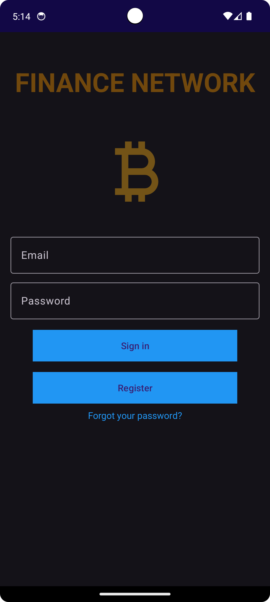
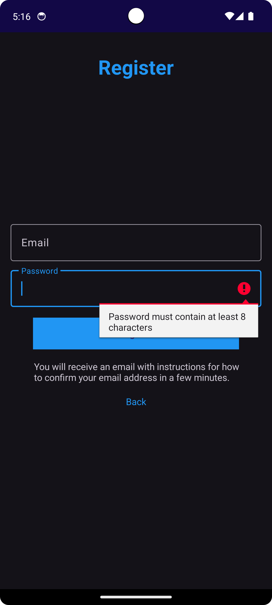
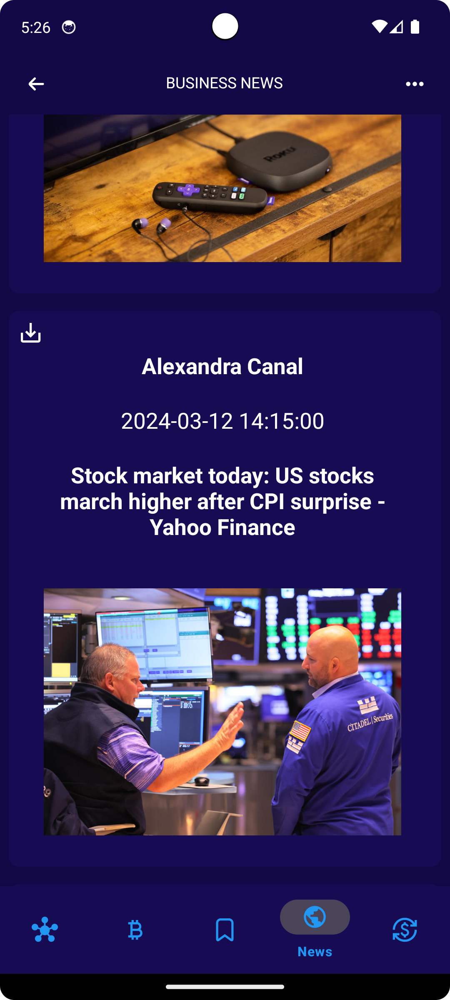
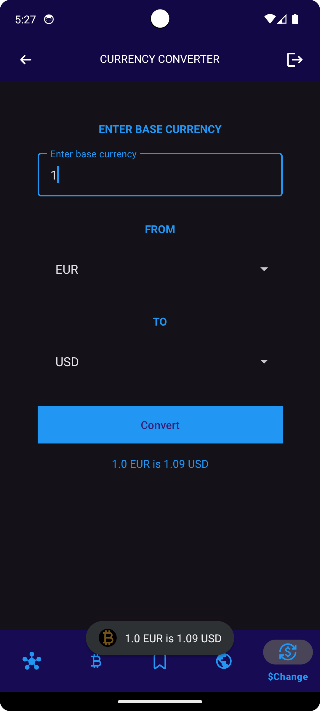

# Finance Network

The Finanz Network app, where those interested in finance can find out more.
The app offers a current cryptocurrency list display,
a currency converter to quickly convert between different foreign currencies,
e.g. euros in US dollars or crowns in euros.
The app also offers the latest business news from the financial world.
## 

## Screenshots

### Start | Login | Register

  
   
   

### Home | Business News | Currency Converter

  
   
   

### Saved Top Currency| Saved News | Impressum

  
   
  

## Technologies & Architecture

#### Technologies
Android, Kotlin

#### Architecture
Model-View-ViewModel (MVVM)

#### Firebase
* Authentication
* Verification
* Password Reset
* Realtime Database
* Storage

#### Api Call
* Retrofit
* Moshi
* OkHttp
* ApiService + Repository

#### Local DB
* **ROOM**
* **DAO**/**CRUD**-Function(Create/Insert, Read/Get, Delete)

#### Image
* Coil
* Glide

#### Architecture Components
[ViewModel](https://developer.android.com/topic/libraries/architecture/viewmodel), [LiveData](https://developer.android.com/topic/libraries/architecture/livedata), [DataBinding](https://developer.android.com/topic/libraries/data-binding),
[Navigation](https://developer.android.com/guide/navigation/)

## Features

**START:** LOGIN * CREAT ACCOUNT * PASSWORD RESET

**CRYPTO CURRENCY:** List of "CRYPTO CURRENCY", refresh list, save and decline "CRYPTO CURRENCY "

**BUSINESS NEWS:** The latest "BUSINESS NEWS", save and decline "NEWS"

**CURRENCY CONVERTER:** "CURRENCY CONVERTER" calculator to quickly convert between different foreign currencies

**Profile:** Add/change Picture, save and change Name/Number

**General:** Auto login, bottom navigation, toast messages, animation
